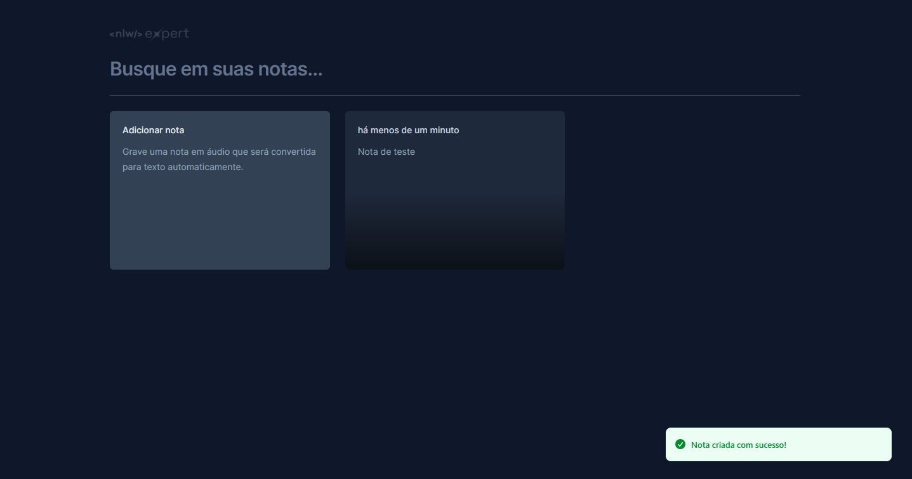

<div align="center">
 <h1>NLW Expert - Notes </h1>
 </img> 
</div>

<div align="center"> 
<a align="center" href="#📁-sobre-o-projeto">Sobre</a> |
<a align="center" href="#⚙️-tecnologias">Tecnologias</a> |
<a align="center" href="#🛠️-funcionalidades">Funcionalidades</a> |
<a align="center" href="#💻-instalação">Instalação</a> |
<a align="center" href="#📞-contato">Contato</a> 
</div>

## 📁 Sobre o projeto

O projeto faz parte da semana NLW Expert da Rocketseat, onde na trilha de React foi apresentado um projeto cujo objetivo é ser um WebApp responsivo que cadastra e apaga notas localmente por texto ou pela API de reconhecimento de voz.


## ⚙️ Tecnologias

- TypeScript
- Date-fns
- Radix
- API Speech Recognition
- Tailwind
- Sonner
- Vite
- CSS
- HTML
- Git & Github
- React
  - Lucide-react

## 🛠️ Funcionalidades

- Criar notas
  - Por texto e por voz.
- Apagar notas
- Pesquisar e filtrar notas



## 💻 Instalação

O projeto teve seu deploy feito utilizando o Netlify e está disponível <a href="https://expert-notes-175.netlify.app/" target="_blank">aqui</a>. Mas você pode realizar o clone do projeto e instalar ele seguindo estes passos:

> **1. Clone o projeto:**

```bash
$ git clone https://github.com/loren175/expert-notes
```

> **2. Acesse a pasta do projeto:**

```bash
$ cd expert-notes
```

> **3. Instale as dependências:**

```bash
$ npm install
```

> **4. Inicie o servidor com o script:**

```bash
$ npm run dev
```

> > ❓ Tenha em mente que é necessário ter instalado em sua máquina o **NodeJS** e o **NPM** para utilizar este projeto localmente.

## 📞 Contato 

> rafael.loren175@gmail.com

> +55 (11) 99959-9140

[](https://www.linkedin.com/in/rafael-mota-084825211/)
